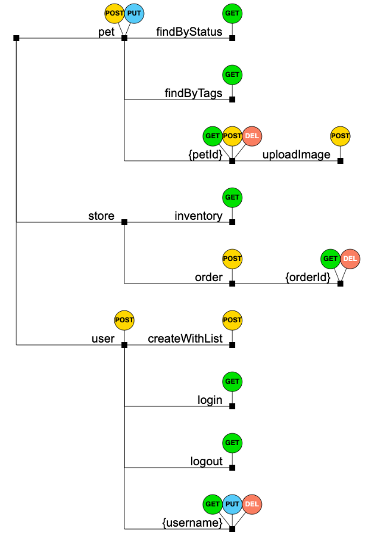

# beautiful-apis

This project aims to show an overview of the endpoints defined in an openapi/swagger specification.

You can try it for yourself here: https://michelgrootjans.github.io/beautiful-apis/

There's many api's to play with [here](https://github.com/APIs-guru/openapi-directory).

This is an example taken from the [Petstore swagger](https://github.com/swagger-api/swagger-petstore/blob/master/src/main/resources/openapi.yaml)

